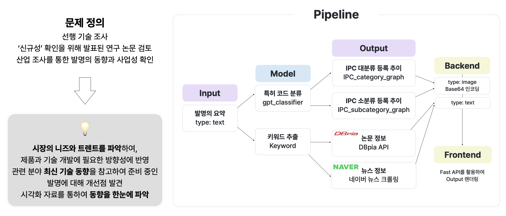

# [KPMG2024] PAPA: Patent Automation & Productivity Accelerator

 

## 📢 개요
본 제안은 특허 출원 과정을 혁신적으로 단순화하고 효율화하는 'All-In-One 특허 출원 보조 서비스'를 개발하는 것을 목표로 한다. 이 서비스는 특허 명세서 작성 보조, 국내외 특허 유사도 판별, 그리고 R&D 연구 동향을 반영한 대시보드 기능을 통합한 종합 솔루션을 제공한다.

## 📑 문제정의
특허는 발명 보호를 통해 경쟁 우위 확보, 기술에 대한 독점적 사용권을 확보하여 수익 창출 및 투자 유치, 법적 보호, 기술의 공개를 통해 국가 산업의 발전을 위해 기업이 반드시 준비해야 하는 부분이다. 하지만 특허 출원 과정은 복잡하고, 시간이 많이 소요되며, 특히 명세서 작성은 전문적인 지식을 요구한다.

.png)\](../assets/patent_difficulty.png)](../assets/patent_difficulty.png)

## ⚙️ 해결방안 및 주요기능
### 1. **특허 명세서 작성 보조:** 
AI 기반 언어 처리 기술을 활용하여 사용자가 보다 정확하고 전문적인 특허 명세서를 작성할 수 있도록 지원한다.

### 2. **유사도 판별:** 
고급 데이터 분석을 통해 국내 및 해외 특허 데이터베이스 내 유사 특허를 식별하고, 출원 전략 수립에 필요한 정보를 제공한다.

1. **데이터셋 정제**: 특허청 수집 데이터 약 40만 건에 대해 분류 

2. **Sentence embedding model (SBERT)**: 

    SBERT는 의미론적으로 의미 있는 문장 임베딩을 도출 가능.
    
    - 국내 특허 : 한국어를 기반으로 사전 훈련된 snunlp/KR-SBERT-V40K-klueNLI-augSTS 활용
    - 해외 특허 : 영어 및 특허 데이터를 기반으로 사전 훈련된 AI-Growth-Lab/PatentSBERTa 활용
    
    특허 문서의 번역: 생성형 AI의 파인튜닝, 그러나 서비스의 속도 및 효율 고려한 API 번역

유사도 계산:
코사인 유사도로 1차 문서 분석 → GPT를 활용하여 산업분류코드 (IPC)로 2차 필터링

### 3. **R&D 연구 동향 대시보드:** 
최신 연구 동향과 산업 변화를 실시간으로 반영하는 대시보드를 통해 사용자에게 중요한 R&D 정보와 시장 전망을 제공한다.

이 서비스는 특허 출원 과정을 체계적으로 지원하며, 사용자에게 시간과 비용을 절감할 수 있는 효율적인 경험을 제공한다. 또한, AI와 머신러닝 기술의 통합으로 특허 출원 과정에서의 복잡성을 줄이고, 더욱 정확하고 신뢰할 수 있는 결과를 도출하고자 한다.

## 팀원소개

이름 | 역할                  
--- | --------------------
김지수 | 프론트엔드/UIUX
김채연 | 모델링
성현준 | 네트워크/DB/크롤링
양진성 | 모델링
이우흥 | 백엔드
정지원 | 모델링